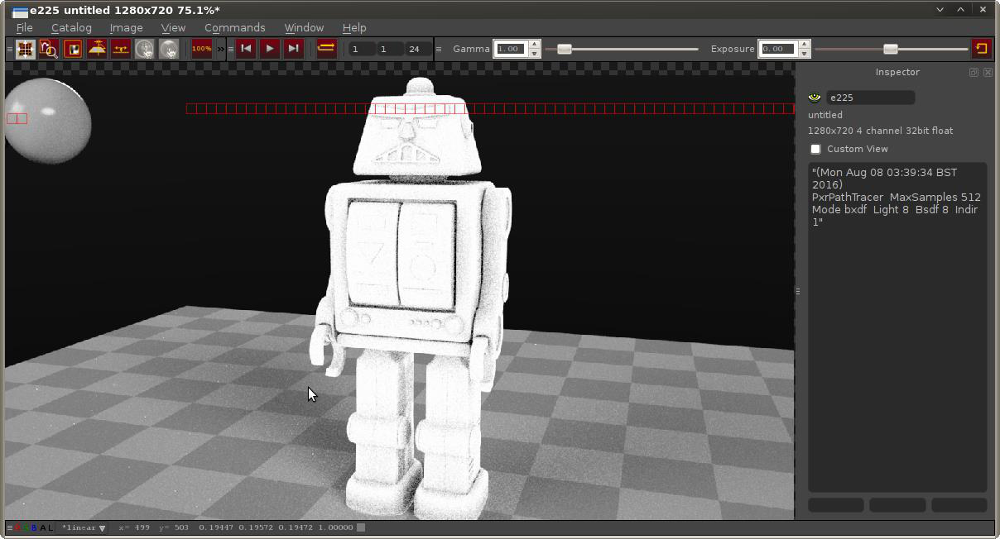
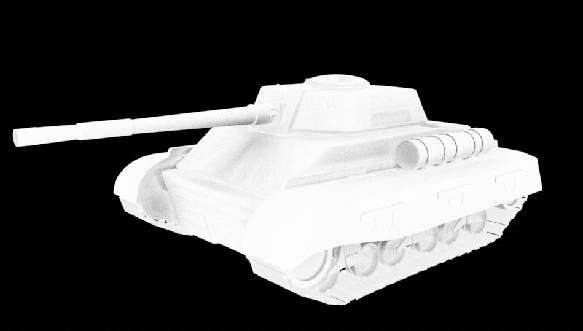
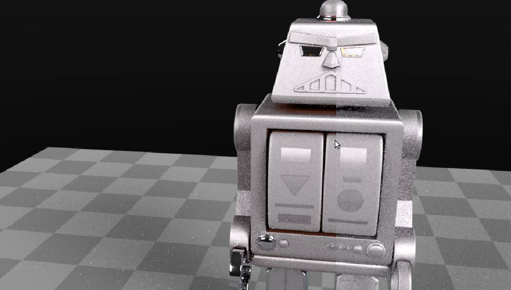

# Renderman Occlusion Shader

Before PRMan21 was released with a PxrDirt shader, there was no simple way to use occlusion in custom shader networks.
This is a minimal attempt to fill in that gap, it has been lightly tested while developing the shaders for an animation project but wasn't necessary in the end. However, you may still find some use for it! It was a valuable learning experience regardless.


  
*PxrConstant example usage*

## Features
* Supplied with an args file ready to be used in Maya
* Ideal for masking layered materials
* Various adjustable parameters
    * Maximum Distance
    * Distance Scale
    * Primary/Secondary colour mixing for more exotic effects than a grayscale mask
    
  
*Masking layers with PxrLm materials*
    
## Build
```
mkdir build
cd build
cmake ..
```
or if *RMANTREE* is not set (or you would like to force a specific renderman version):
```
cmake .. -DPRMAN_LOCATION="D:\Program Files\Pixar\RenderManProServer-20.11"
```

Once the build files are generated, you can explicitly build the solution in your development environment of choice or do:
```
cmake --build .
```

## Install
**ToDo**
* Set RMS_SHADER_PATH

## Thanks

[fundza](http://www.fundza.com/index_RIX.html) is an invaluable resource for anything Renderman related.
